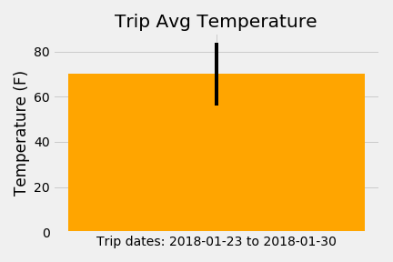

# sqlalchemy-challenge
Climate Analysis and Exploration and app

## Climate Analysis and Exploration

View [climate.ipynb](climate.ipynb) for the full climate analysis and exploration.

The notebook created the following graphs:

### Precipitation by Date for last year in the database

### Temperature histogram for station with most observations for last year in the database

## Climate App

[app.py](app.py) Is a Flask API to return JSON data from the [hawaii.sqlite](Resources/hawaii.sqlite) database.

### Available Routes

/api/v1.0/precipitation
* Returns a JSON list of precipitation by date over the last year in the database.

/api/v1.0/stations
* Returns a JSON list of station data.

/api/v1.0/tobs
* Returns a JSON list of temperature data over the last year in the database at the most popular station.

/api/v1.0/<start_date>
* Date parameter must be in format YYYY-MM-DD to return a result. Returns a JSON list of the minimum temperature, the average temperature, and the max temperature between a given start date and last date in database. Date range in database is 2010-01-01 to 2017-08-23

/api/v1.0/<start_date>/<end_date>
* Date parameters must be in format YYYY-MM-DD to return a result. Returns a JSON list of the minimum temperature, the average temperature, and the max temperature between a given start date and end date. Date range in database is 2010-01-01 to 2017-08-23

N.B.: Date range and station with most observations are variable should more data be added to the database.

## Bonus Analysis

### Trip Temperature Analysis

Further down in the aforementioned [notebook](climate.ipynb), you can input dates of a trip to analyse the temperature of the previous year's dates, then plot a bar chart of the average temperature, with an error bar calculated from the max and min temperatures.

